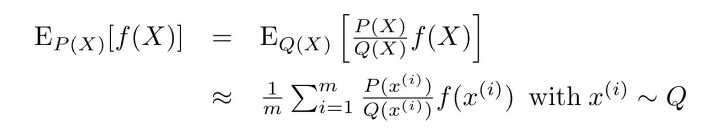
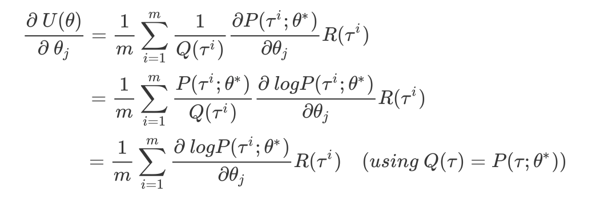

# On a Connection between Importance Sampling and the Likelihood Ratio Policy Gradient {Tang 10}

 [`Paper link`](http://rll.berkeley.edu/~jietang/pubs/nips10_Tang.pdf)

Likelihood Ratio Policy Gradient(이하 PG)에 Importance Sampling을 적용함으로써, Current Policy로만 사용하며 estimation을 하는것이 아니라, 과거 Trajectory의 experience를 사용하여 좀 더 효율적인 학습을 할 수 있다고 제시한 논문이다. 

간략히 Importance sampling에 대해 설명을 하고 PG에서 Importance Sampling을 어떻게 적용하는지 살펴보겠다.

### Importance Sampling

Importance Sampling은 P(x) 분포를 따르는 확률변수 X를 P(x)로 부터 샘플링하기 어려울때, P(x)와 다른 분포인 Q(x)로 부터 샘플링하여 estimation을 하는 샘플링 기법이다. 아래 식은 Importance Sampling에서 P(x)를 Q(x)로 대체하고 확률 변수 X를 Q(x)로부터 샘플링하여 estimation할 수 있음을 보여준다.

### PG via Importance Sampling

Importance sampling을 PG에 적용하여 설명하자면, 일반적인 Likelihood Ratio PG는 Current Policy로부터 rollout하여 Return을 구한다. 즉, 과거 Policy들은 Return을 구하는데 활용하지 않는다. 이러한 접근은 과거 Policy의 정보를 활용하지 못한다는 점에서 한계를 가진다. 이 논문은 이 문제에 Importance Sampling을 적용하여 해결책을 제시한다. 

여기서 P(tau)는 Current Policy를 의미하고 Q는 Past Policy(에이전트가 지금까지 경험한 Policy)를 의미한다. 

Importance Sampling을 적용한 PG는 현재까지의 rollout으로 부터 구한 Past Policy를 사용하기 때문에 standard PG보다 더 적은 trial으로 학습을 할 수 있다. 