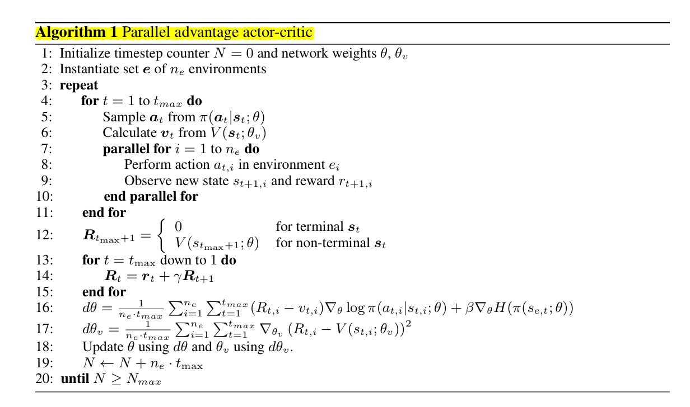

# Efficient Parallel Methods for Deep Reinforcement Learning

[`link`](https://arxiv.org/abs/1705.04862)

1. 효율적으로 병렬 강화학습을 할 수 있는 알고리즘이다. 여러 개의 actor가 하나의 machine에서 학습을 할 수 있다.
2. On-policy, Off-policy, Value based, policy based 상관없이 적용 가능하다. GPU를 효율적으로 사용할 수 있다. 그로 인해서 파워풀하게 학습 시간을 줄일 수 있다.
3. 그동안 RL에서 두가지 이슈가 있음(상태간의 상관관계, on-policy에서 분포가 바뀌는 현상). 첫번째 문제는 리플레이 메모리를 이용하여 해결, 두번째는 비동기 학습으로 해결
4. 각각의 해결방법에는 단점이 있음.(리플레이 메모리는 off-policy에서 밖에 적용이 안됨. 비동기 방식은 일관성 없는 업데이트와 다른 스레드에서 동시에 파라메터 업데이트가 이루어짐)
5. Gorilla(multi DQN) 같은경우에는 여러 러너가 공통 메모리를 통해서 학습함. 메모리는 여러 액터들이 공통으로 모음.(DQN보다 gorila가 성능이 더 좋음)
6. A3C나 Gorilla와 다르게, PAAC은 한번만 업데이트 됨. 그럼으로써 비동기방식의 단점을 피할 수 있음. GA3C와 비슷하지만 큐를 사용하지 않아서 더 간단하고 효율적으로 계산할 수 있다.
7. 여러개의 다른 환경에서 오는 state space 덕분에 correlation을 줄일고 있고, 안정적인 학습을 도와준다. 이 방법은 on-line experience memory가 될 수 있다. 이 전 경험을 샘플링 하는 대신에 현재의 다른 환경에서 관찰되는 경험을 샘플링한다.
8. 이 논문에서는 n-step a2c를 사용하여 PAAC를 구현. conv layer는 합쳐져있고, output만 나눠서 value와 policy로 나뉨.